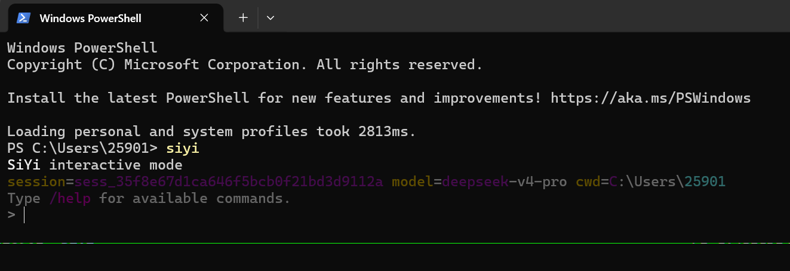
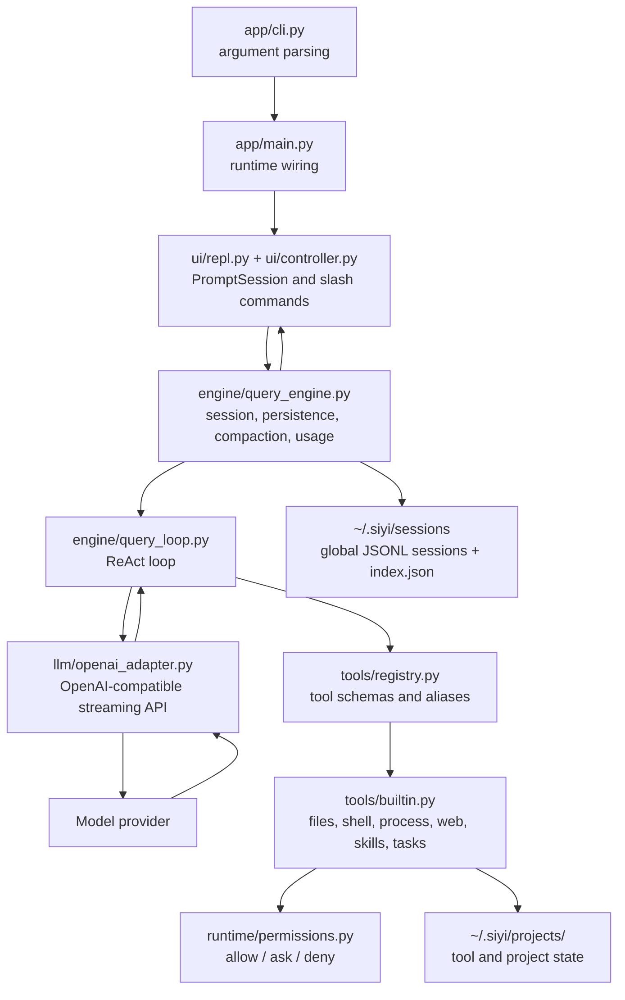

# SiYi

[中文文档](README.zh-CN.md)

SiYi is an experimental command-line agent framework inspired by Claude Code and Codex. It provides a ReAct-style conversational loop, OpenAI-compatible streaming model calls, a permission-aware tool system, persistent sessions, project-scoped agent state, global skills, and Codex-style process sessions for interactive shell workflows.

The project is still early, but it is already useful as a compact reference implementation for building a local coding agent.

## Highlights

- ReAct loop with streaming assistant output, tool calls, tool results, and final answers.
- OpenAI-compatible adapter with streaming usage support.
- Permission-aware tools with read/write separation and explicit approval for risky actions.
- Short shell tools for non-interactive commands, plus persistent process sessions for long-running or interactive commands.
- Global sessions with fast lookup through `~/.siyi/sessions/index.json`.
- Project state outside the repository, stored under `~/.siyi/projects/<safe_cwd_name>-<cwd_hash>/`.
- Global skills under `~/.siyi/skills`, plus user-added skill roots and GitHub skill installation.
- Context budget estimation and automatic compaction for long conversations.

## Get Started

### Requirements

- Python 3.11+
- An OpenAI-compatible API endpoint and API key
- PowerShell on Windows, or Bash on Unix-like systems

### Install From Source

```bash
git clone <repo-url>
cd SiYi
python -m venv .venv
```

Activate the virtual environment:

```bash
# Windows PowerShell
.\.venv\Scripts\Activate.ps1

# macOS/Linux
source .venv/bin/activate
```

Install SiYi:

```bash
pip install -e ".[dev]"
```

### Configure a Model

You can configure the model interactively:

```bash
siyi
```



Then run:
```text
/login
```

Or configure through environment variables:

```bash
export SIYI_API_KEY="your-api-key"
export SIYI_BASE_URL="https://api.openai.com/v1"
export SIYI_MODEL="gpt-4o-mini"
```

On Windows PowerShell:

```powershell
$env:SIYI_API_KEY = "your-api-key"
$env:SIYI_BASE_URL = "https://api.openai.com/v1"
$env:SIYI_MODEL = "gpt-4o-mini"
```

### Run

```bash
siyi --cwd .
```

Useful startup options:

```bash
siyi --model gpt-4o-mini
siyi --model-tier balanced
siyi --resume
siyi --resume sess_xxx
siyi --print-thinking
```

## Common REPL Commands

```text
/help                         Show available commands
/login                        Configure API settings
/session                      Show current session details
/sessions                     List global sessions
/session_new                  Start a new session for the current cwd
/session_switch <session_id>  Switch to a global session and follow its cwd
/history [count]              Show recent transcript messages
/compact [instructions]       Manually compact the current context
/retry                        Retry the latest user prompt
/add_skill_path <path>        Add a global skill search path
/add_skills <github_address>  Clone a GitHub skill repo into ~/.siyi/skills
/exit                         Exit the REPL
```

## Architecture



## Core Concepts

### QueryEngine

`QueryEngine` owns the user-facing conversation state. It appends user messages, runs the query loop, persists generated messages and events, tracks usage, handles compaction, and exposes session operations.

### Query Loop

`DefaultQueryLoop` implements the ReAct cycle:

```text
messages -> model stream -> assistant blocks -> tool calls -> tool results -> model again
```

The loop continues until the model naturally stops calling tools or an error occurs.

### Tool System

SiYi exposes canonical tool schemas to the model and resolves aliases locally. This keeps the model-facing tool list clean while still allowing familiar names such as `read_file`, `grep`, or `shell`.

Notable tools include:

- `Read`, `Write`, `Edit`, `NotebookEdit`
- `Glob`, `Grep`
- `PowerShell`, `Bash`
- `ProcessStart`, `ProcessRead`, `ProcessWrite`, `ProcessStop`
- `WebSearch`, `WebFetch`
- `TaskCreate`, `TaskGet`, `TaskList`, `TaskUpdate`
- `Skill`
- `ToolSearch`

### Process Sessions

Short commands should use `PowerShell` or `Bash`. Long-running or interactive commands should use process sessions:

```text
ProcessStart -> ProcessRead -> ProcessWrite -> ProcessStop
```

This design keeps normal shell calls short and predictable while still supporting stdin-driven interactive flows.

### Sessions and Project State

Sessions are global:

```text
~/.siyi/sessions/<session_id>.jsonl
~/.siyi/sessions/index.json
```

Project state is separated from the repository:

```text
~/.siyi/projects/<safe_cwd_name>-<cwd_hash>/
```

This avoids writing agent bookkeeping files into the user project directory.

## Development

Run tests:

```bash
pytest
```

Install in editable mode with test dependencies:

```bash
pip install -e ".[dev]"
```

## License

See [LICENSE](LICENSE).
