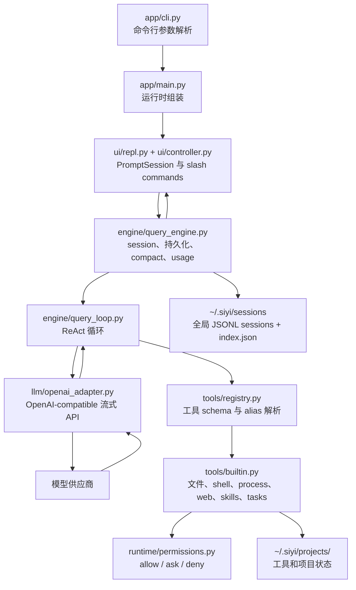

# SiYi

[English README](README.md)

SiYi 是一个实验性的命令行 Agent 框架，设计上参考了 Claude Code 和 Codex。它实现了 ReAct 风格的对话循环、OpenAI-compatible 流式模型调用、带权限治理的工具系统、持久化 session、项目级状态存储、全局 skills，以及 Codex 风格的 process session 机制，用于处理长时间运行或需要 stdin 交互的 shell 流程。

这个项目仍处在早期阶段，但已经可以作为一个轻量、清晰的本地 coding agent 架构参考。

## 核心亮点

- ReAct 对话循环：支持流式 assistant 输出、工具调用、工具结果回传和最终回答。
- OpenAI-compatible adapter：支持流式响应和 usage 统计。
- 权限感知工具系统：区分只读/写入/危险操作，并支持显式审批。
- 普通 shell 工具用于短命令，process session 用于长任务和交互式命令。
- 全局 sessions，通过 `~/.siyi/sessions/index.json` 快速查找和切换。
- 项目状态不污染代码仓库，统一存放在 `~/.siyi/projects/<safe_cwd_name>-<cwd_hash>/`。
- 全局 skills：默认读取 `~/.siyi/skills`，支持添加自定义 skill path，也支持从 GitHub 安装 skill 仓库。
- 上下文预算估算和自动 compact，支持较长对话。

## 快速开始

### 环境要求

- Python 3.11+
- 一个 OpenAI-compatible API endpoint 和 API key
- Windows 上使用 PowerShell，Unix-like 系统上使用 Bash

### 从源码安装

```bash
git clone <repo-url>
cd SiYi
python -m venv .venv
```

激活虚拟环境：

```bash
# Windows PowerShell
.\.venv\Scripts\Activate.ps1

# macOS/Linux
source .venv/bin/activate
```

安装 SiYi：

```bash
pip install -e ".[dev]"
```

### 启动

```bash
siyi 
```

常用启动参数：
```bash
siyi --model gpt-4o-mini
siyi --model-tier balanced
siyi --resume
siyi --resume sess_xxx
siyi --print-thinking
```


### 配置模型

可以在 REPL 中交互式配置：

```bash
siyi
```

然后输入：

```text
/login
```


也可以通过环境变量配置：

```bash
export SIYI_API_KEY="your-api-key"
export SIYI_BASE_URL="https://api.openai.com/v1"
export SIYI_MODEL="gpt-4o-mini"
```

Windows PowerShell：

```powershell
$env:SIYI_API_KEY = "your-api-key"
$env:SIYI_BASE_URL = "https://api.openai.com/v1"
$env:SIYI_MODEL = "gpt-4o-mini"
```


## 常用 REPL 命令

```text
/help                         查看所有命令
/login                        配置 API 设置
/session                      查看当前 session 信息
/sessions                     列出全局 sessions
/session_new                  为当前 cwd 创建一个新 session
/session_switch <session_id>  切换到全局 session，并跟随该 session 的 cwd
/history [count]              查看最近对话消息
/compact [instructions]       手动压缩当前上下文
/retry                        重试最近一次用户输入
/add_skill_path <path>        添加全局 skill 搜索路径
/add_skills <github_address>  将 GitHub skill 仓库 clone 到 ~/.siyi/skills
/exit                         退出 REPL
```

## 架构图



## 核心概念

### QueryEngine

`QueryEngine` 负责面向用户的一轮对话状态管理。它会追加用户消息，调用 query loop，持久化模型生成的消息和事件，记录 usage，处理 compact，并提供 session 新建、列出和切换能力。

### Query Loop

`DefaultQueryLoop` 实现 ReAct 循环：

```text
messages -> 模型流式输出 -> assistant blocks -> 工具调用 -> 工具结果 -> 再次调用模型
```

这个循环会一直运行，直到模型自然停止工具调用，或者发生错误。

### 工具系统

SiYi 只把 canonical tool schema 暴露给模型，alias 在本地解析。这样模型看到的工具列表更干净，同时仍然支持 `read_file`、`grep`、`shell` 这类熟悉的名称。

主要工具包括：

- `Read`, `Write`, `Edit`, `NotebookEdit`
- `Glob`, `Grep`
- `PowerShell`, `Bash`
- `ProcessStart`, `ProcessRead`, `ProcessWrite`, `ProcessStop`
- `WebSearch`, `WebFetch`
- `TaskCreate`, `TaskGet`, `TaskList`, `TaskUpdate`
- `Skill`
- `ToolSearch`

### Process Sessions

短命令应该使用 `PowerShell` 或 `Bash`。长时间运行、需要 stdin、需要多次读取输出的命令应该使用 process session：

```text
ProcessStart -> ProcessRead -> ProcessWrite -> ProcessStop
```

这种设计避免普通 shell tool 被交互式命令卡住，同时保留了处理复杂终端流程的能力。

### Sessions 与 Project State

Sessions 是全局的：

```text
~/.siyi/sessions/<session_id>.jsonl
~/.siyi/sessions/index.json
```

Project state 独立于用户代码仓库：

```text
~/.siyi/projects/<safe_cwd_name>-<cwd_hash>/
```

这样可以避免在用户项目根目录下写入 agent 内部状态文件。

## 开发

运行测试：

```bash
pytest
```

以 editable 模式安装并带上测试依赖：

```bash
pip install -e ".[dev]"
```

## License

见 [LICENSE](LICENSE)。
